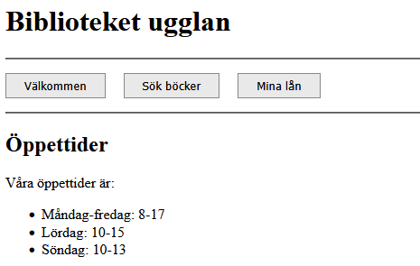

## 📊 Status Veckouppgift 6 Webben


Här nedan presenteras en översikt över statusen på lösande av uppgfterna.

| Uppgift                 | Status |
|:------------------------|:------:|
| 1. Diskutera i grupp  |   🟢   |
| 2. Öva på HTML        |   🟡   |
| 3. Gå en kurs         |   🔴   |
| 4. Extra övningar     |   🔴   |


## 1️⃣ Diskutera i grupp

### 1a Vilka sorters HTML-element kan du se på w3schools-sidan?

```html
<html> <head> <title> <body> <header> <main> <div> <a>  <nav> <button> <style> <link> <script> <h1> <h2> <p>   
```

### 1b Vilka sorters element finns det på wikipedia-sidan om Thutmose II?
```html
<html> <head> <title> <body> <header> <main> <div> <a>  <figure> <nav> <button> <style> <link> <aside> <span> <script> <h1> <h2> <h3 ><p> <ul> <li> <section> <form> <input> <label> <table> <tbody> <tr> <td>  
```

### 1c Koden för webbsidan har råkat blandas.
Ok

### 1d Hitta så många fel som möjligt i följande HTML.
```html
<main>
    <section>
        <h1>Find the error</h1>
        <p>This is an example of an HTML file. It contains several errors.</p>
        
        <p>Can you find them all?</p>
    </section>
</main>
```

## 2️⃣ Öva på HTML

1. Bygg en webbsida för biblioteket ugglan  

Mitt resultat:



Länk till hemsidan byggd på min kod:

<a href="https://matsan66.github.io/06_webben/ugglan/">
    <strong>📚 Biblioteket Ugglan</strong>
</a>